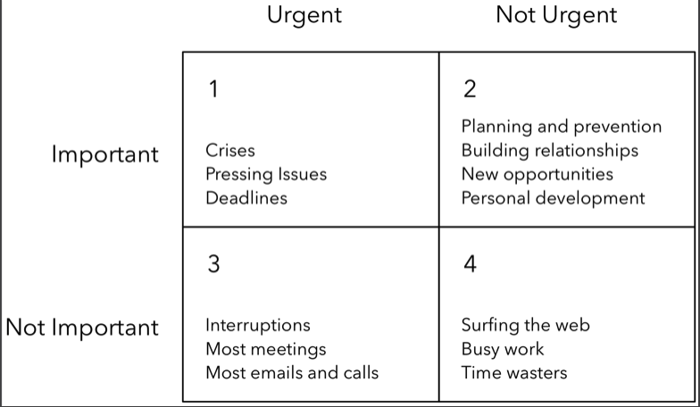

# Chapter 3 - Prioritize Regularly

Prioritize int't only relevant to user growth, however. In any engineering discipline(and in life), there will always be more tasks to do than you have time for. Therefore, regular prioritization is a high-leverage activity, because it determines the leverage of the rest of your life.

Prioritization is hard work, and like most skills, it requires practice.The most effective engineers work persistently on improving their prioritization skills.
For personal and professional goals, taking the time and energy to prioritize will significantly increase your chances for success.

## 1. **Track To-Dos in a Single, Easily Accessible List**

The fist step in effective prioritization is listing every task you might need to do. **David Allen**, the arthur of ***Getting Things Done***, this is because the human brain is optimized for processing and not for storage. The average can actively hold only 7 +/- 2 items. Thus the goal of this activity is to free up your mind to focus on **high-leverage** activity, which is prioritizing your work.
 - Estimating both the time required and the value produced by that is incredibly hard.
 - Ask yourself on a recurring basis: *Is there something else I could be doing that's higher-leverage?*
 - The goal of this todo-list idea is not about how precisely you estimate. It's about making a habit of shifting your opt priorities toward the ones with the highest leverage, with given information you have

## 2. **Focus on What Directly Produces Value**
The time and effort expanded do not necessarily correlate with the value produced. "Activity is not necessarily production." and that many work activities "do not directly contribute towards useful output. Writing status reports, organizing things, creating organizational systems, recording things, going to meetings, and replying to low-priority communications are all examples of this."
- The fist heuristic for prioritizing high-leverage activities is to focus on what directly produces value.
- What matters is how much value you've created.
  - Products shipped, users acquired, business metrics moved, or sales made.
  - Rather than in terms of hours worked, tasks completed, lines of code written or meetings attended
  - When you get the important things right, small things often don't matter
- Prioritize the onces that produce the most value with the least amount of effort.
  - It becomes easier to recognize which tasks are most variable if you keep doing it.
- Learn to say no.
  -  Don't treat every invitation to do something as an obligation.
  -  Explain how the meeting, bug, or project will detract from your other other tasks.

**Don't try to get everything done. Focus on what matters - and is what produces value.**

## 3. **Focus on the Important and Non-Urgent**
Stephen Covey - the arthur of *In The 7 Habits of Highly Effective People* explains that urgency shouldn't be confused with importance. Convey partitions the activities that we do into four quadrants, based on whether they're urgent or non-urgent and important or unimportant.

- Carve out time to invest in skills development
  - Your productivity might slow down at first, but with time, the new tools and workflows that they learn will increase their effectiveness and easily compensate for the initial loss.

Nimrod Hoofien, an engineering director at Facebook labels everything on his to-do list from 1 through 4, based on which quadrant the activity fell under. - "worked really well when what you're trying to do is to whittle down what you do to the important [and] not urgent"

Find which of your to-dos fall within quadrant 2, and de-prioritize quadrant 3 and 4 activities that aren't important.
Be wary if you are spending too much time on quadrant 1, it's usually firefighting all may be important and urgent, but assess whether you're simply addressing the symptoms of the problem and not its underlying cause.
Oftentimes, the root cause is an underinvestment in a quadrant 2 activity. E.g. high-priority bugs might be a symptom of low test coverage. Constant deadlines might be caused by poor project estimation and planning. Investing in quadrant 2 solutions can reduce urgent tasks and their associated stress.

***Prioritize the act of prioritization, and you'll be on the road to dramatically increasing your effectiveness***

 
 

***Excerpt From***
The Effective Engineer: How to Leverage Your Efforts in Software Engineering to Make a Disproportionate and Meaningful Impact
Edmond Lau
This material may be protected by copyright.